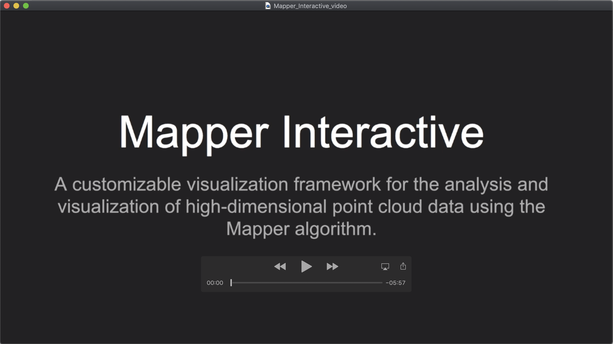

# Mapper interactive

Mapper Interactive is a web-based framework for interactive analysis and visualization of high-dimensional point cloud data  built upon the Mapper algorithm. It is an open source software released under the MIT License.

The Mapper algorithm is a tool from topological data analysis first introduced by Gurjeet Singh, Facundo Mémoli and Gunnar Carlsson in 2007 (http://dx.doi.org/10.2312/SPBG/SPBG07/091-100). 


## Installation

```bash
git clone https://github.com/MapperInteractive/MapperInteractive.git (or git clone git@github.com:MapperInteractive/MapperInteractive.git)
cd MapperInteractive
python3 run.py
```

After running the above commands, you can run Mapper Interactive by visiting http://127.0.0.1:8080/ on the local machine (If possible, please use Chrome).

## Dependencies
This software requires [Kepler Mapper](https://kepler-mapper.scikit-tda.org/), [scikit-learn](https://scikit-learn.org/stable/), [NetworkX](https://networkx.github.io/) and [flask](https://flask.palletsprojects.com/en/1.1.x/) to run.

If you do not have these packages installed, please use the following command to intall them.

```bash
pip install scikit-learn
pip install networkx
pip install flask
pip install flask_assets
```

To perform linear regression, please also make sure you have [statsmodels](https://www.statsmodels.org/stable/index.html) installed.
```bash
pip install statsmodels
```

## Loading a dataset
When loading a dataset into the interface, please make sure to put the data file to be loaded in the folder ``app/static/uploads/``.

## Command-line API
Please refer to a user-guide [here](CLI_README.md) for the command-line API.

## Video

[](https://www.youtube.com/watch?v=KxHHrCXwGEI)

## License

This project is licensed under the MIT License - see the `LICENSE` file for details.

## Contributing

Pull requests are welcomed. 

## Cite

Mapper Interactive: A Scalable, Extendable, and Interactive Toolbox for the Visual Exploration of High-Dimensional Data.
Youjia Zhou, Nithin Chalapathi, Archit Rathore, Yaodong Zhao, Bei Wang.\
*IEEE Pacific Visualization (PacificVis)*, accepted, 2021.

https://arxiv.org/abs/2011.03209.


